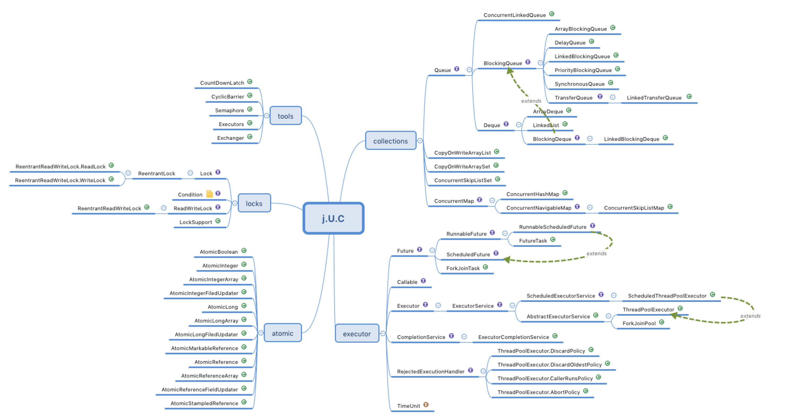

# 不可变对象
final修饰类、方法、变量
- 修饰类：不能被继承
- 修饰方法：该方法不能被重写；效率；
- 修饰变量：
    1. 修饰基本数据类型变量，一旦变量初始化，那么该变量的值不能被修改
    2. 修饰引用类型变量，一旦初始化之后，那么不能将它指向另外一个对象
> - final修饰的类中，所有的方法都是隐式的final方法
> - 所有的私有方法都是隐式的final方法

直接使用：
- `Collections.unmodifiablexxx: Collection/List/Set/Map...`
- `Guava: Immutablexxx: Collection/List/Set/Map...`

# 线程封闭
使用ThreadLocal存储线程中的变量。应用在数据库连接池、保存当前用户标识等场景。

# 同步容器
ArrayList -> Vector/Stack
HashMap -> HashTable(key/value都不能为null)
Collections.synchronizedxxx(List/Set/Map)

# 并发容器
### CopyOnWriteArrayList
最主要是其实现add方法的策略，源码如下：
```java
    /**
     * Appends the specified element to the end of this list.
     *
     * @param e element to be appended to this list
     * @return {@code true} (as specified by {@link Collection#add})
     */
    public boolean add(E e) {
        final ReentrantLock lock = this.lock;
        lock.lock(); // 获取锁
        try {
            Object[] elements = getArray(); // 得到原数组
            int len = elements.length;
            Object[] newElements = Arrays.copyOf(elements, len + 1); // 将原数组复制一份，并且长度+1了
            newElements[len] = e; // 将要增加的元素放到新数组末尾
            setArray(newElements); // 用新数组替换原数组
            return true;
        } finally {
            lock.unlock(); // 释放锁
        }
    }
```
对其get方法，直接返回数组中的值就行，不需要锁
缺点：每次新增元素需要重新复制数组，导致资源浪费，触发GC。适用于读操作比较多的情况。

