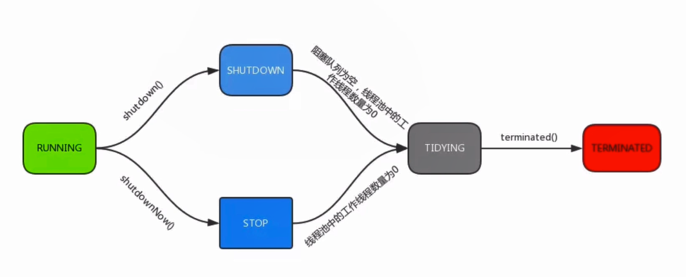

# 核心参数
```java
    /**
     * Creates a new {@code ThreadPoolExecutor} with the given initial
     * parameters.
     *
     * @param corePoolSize the number of threads to keep in the pool, even
     *        if they are idle, unless {@code allowCoreThreadTimeOut} is set
     * @param maximumPoolSize the maximum number of threads to allow in the
     *        pool
     * @param keepAliveTime when the number of threads is greater than
     *        the core, this is the maximum time that excess idle threads
     *        will wait for new tasks before terminating.
     * @param unit the time unit for the {@code keepAliveTime} argument
     * @param workQueue the queue to use for holding tasks before they are
     *        executed.  This queue will hold only the {@code Runnable}
     *        tasks submitted by the {@code execute} method.
     * @param threadFactory the factory to use when the executor
     *        creates a new thread
     * @param handler the handler to use when execution is blocked
     *        because the thread bounds and queue capacities are reached
     * @throws IllegalArgumentException if one of the following holds:<br>
     *         {@code corePoolSize < 0}<br>
     *         {@code keepAliveTime < 0}<br>
     *         {@code maximumPoolSize <= 0}<br>
     *         {@code maximumPoolSize < corePoolSize}
     * @throws NullPointerException if {@code workQueue}
     *         or {@code threadFactory} or {@code handler} is null
     */
    public ThreadPoolExecutor(int corePoolSize, // 核心线程数量
                              int maximumPoolSize, // 线程最大线程数
                              long keepAliveTime,
                              TimeUnit unit,
                              BlockingQueue<Runnable> workQueue,
                              ThreadFactory threadFactory,
                              RejectedExecutionHandler handler) {...}
```
- 运行线程数小于corePoolSize，直接创建新线程执行任务，即使线程池中其它线程是空闲的
- 如果线程池中线程数量大于等于corePoolSize且小于maximumPoolSize，当workQueue没满的时候直接放入队列，只有当workQueue满的时候才会创建新线程处理任务
- 如果当前workQueue已经满了，且线程数已经大于maximumPoolSize，那么将会按照给定的拒绝策略来处理

### 常见做法：
- 如果我想降低系统资源消耗，包括CPU使用率、操作系统资源消耗、线程切换开销等，可以设置一个较大的队列容量和一个较小的线程池容量，这样可以
降低线程任务处理吞吐量
- 如果我们提交的任务经常发生阻塞，可以重新设置maximumPoolSize改变线程池最大容量

### 拒绝策略：
- `AbortPolicy`默认的，直接抛出异常
- `CallerRunsPolicy`使用调用线程执行该任务
    ```java
        /**
         * A handler for rejected tasks that runs the rejected task
         * directly in the calling thread of the {@code execute} method,
         * unless the executor has been shut down, in which case the task
         * is discarded.
         */
        public static class CallerRunsPolicy implements RejectedExecutionHandler {...}
    ```
- `DiscardOldestPolicy`抛弃最久未处理的请求
    ```java
        /**
         * A handler for rejected tasks that discards the oldest unhandled
         * request and then retries {@code execute}, unless the executor
         * is shut down, in which case the task is discarded.
         */
        public static class DiscardOldestPolicy implements RejectedExecutionHandler {...}
    ```
- `DiscardPolicy`直接抛弃该任务
    ```java
        /**
         * A handler for rejected tasks that silently discards the
         * rejected task.
         */
        public static class DiscardPolicy implements RejectedExecutionHandler {...}
    ```

# 状态


# 提供的方法
|方法名|描述
|:---:|:---:|
|execute()|提交任务，交给线程池执行
|submit()|提交任务，能够返回执行结果 execute+Future
|shutdown()|关闭线程池，等待任务都执行完
|shutdownNow()|关闭线程池，不等待任务执行完
|getTaskCount()|线程池已执行和未执行的任务总数
|getCompleteTaskCount()|已完成的任务数量
|getPoolSize()|线程池当前的线程数量
|getActiveCount()|当前线程池中正在执行任务的线程数量

# 使用
- Executors.newCachedThreadPool();
- Executors.newFixedThreadPool(10);
- Executors.newSingleThreadExecutor();
- Executors.newScheduledThreadPool(1);

# 并发最佳实践
- 使用本地变量
- 使用不可变类
- 最小化锁的作用域范围：S=1/(1-a+a/n)
- 使用线程池的Executor，而不是直接new Thread 执行
- 宁可使用同步也不要使用线程的wait和notify，多用CountDownLatch、CyclicBarrier、Semaphore这个同步组件
- 使用BlockingQueue实现生产-消费模式
- 使用并发集合(ConcurrentHashMap、CopyOnWriteArrayList等)而不是加了锁的同步集合(Collections.synchronizedXXX)
- 使用Semaphore创建有界的访问
- 宁可使用同步代码块，也不使用同步的方法。主要针对synchronized关键字。如果需要互斥锁，可以考虑使用ReentrantLock。
- 避免使用静态变量


- [参考一](https://blog.csdn.net/jesonjoke/article/details/80202114)
- [参考二](https://blog.csdn.net/IbelieveSmile/article/details/81204545)