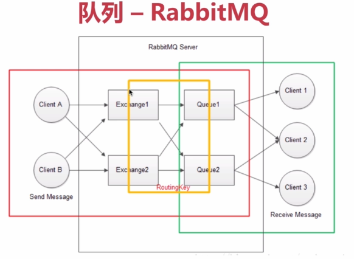

# 扩容
- 垂直扩容(纵向拓展)：提高系统部件能力(比如换成更强的CPU)
- 水平扩容(横向拓展)：增加更多系统成员(比如增加一个CPU)

对数据库来说：
- 读操作拓展：MemCache、Redis、CDN缓存
- 写操作拓展：Cassandra、HBase等

# 缓存
- 本地缓存：编程实现(成员变量、局部变量、静态变量)，Guava Cache
- 分布式缓存：MemCache、Redis

高并发下缓存问题：
- 缓存一致性
- 缓存并发问题
- 缓存穿透问题(缓存空对象、单独过滤处理)
- 缓存的雪崩现象(一致性Hash算法)

# 消息队列
### 消息队列特性
- 业务无关：只做消息分发
- FIFO：先投递先到达
- 容灾：节点的动态增删和消息的持久化
- 性能：吞吐量提升，系统内部通信效率提高
### 消息队列的好处
- 业务解耦
- 最终一致性
- 广播
- 错峰与流控

### 产品举例
- ActiveMQ

- RabbitMQ

- Kafka(分布式、高性能)

[参考](http://www.cnblogs.com/xiangkejin/p/9278356.html)

# 应用拆分
### RPC，实时性更好

一般注册到ZooKeeper

