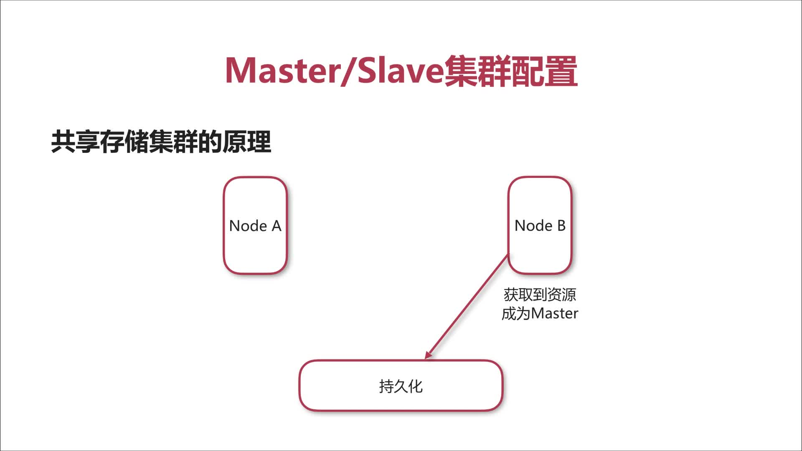

## 基础知识
- 为什么要对消息中间件集群？
    - 实现高可用，以排除单点故障引起的服务中断。
    - 实现负载均衡，以提升效率为更多的客户提供服务。
- 集群方式
    - 客户端集群：让多个消费者消费同一个队列
    - Broker Clusters：多个broker之间同步消息
    - Master Slave：实现高可用
- 客户端也要配置 ActiveMQ失效转移（failover）
    - 允许当其中一台消息服务器宕机时，客户端在传输层上重新连接其他消息服务器。
    - 语法：`failover:(uri1,...,uriN)?transportOptions `
        - uri: 消息服务器的地址 
        - transportOptions 参数说明： 
            - randomize 默认为 true ，表示在URI列表中选择URL连接时是否采用随机策略。 
            - initialReconnectDelay 默认为10，单位为毫秒，表示一次尝试重连之间等待的时间。 
            - maxReconnectDelay 默认 30000，单位毫秒，最长重连的时间间隔。
- Broker clusters：多个broker之间同步消息，实现负载均衡而不高可用
    - 实现原理：多个节点之间消息同步，消费者在任一节点可以获取消息
    - 实现方式：NetworkConnector(网络连接器)，其主要用于配置ActiveMQ服务器与服务器之间的网络通讯方式，用于服务器透传消息。连接方式分为静态连接和动态连接。
    - 静态连接：其配置如下：
        ```text
            <networkConnections>
                <networkConnection uri="static:(tcp://127.0.0.1:61617,tcp://127.0.0.1:61618)"/> 
            </networkConnection>
        ```
    - 动态连接
        ```text
            <!-- 网络连接器 -->
            <networkConnectors>
                <networkConnector uri="multicast://default" /> 
            </networkConnectors>
            <!-- 传输连接器 -->
            <transportConnectors>
                <transportConnector uri="tcp://localhost:0" discoveryUri="multicast://default" />
            </transportConnectors>
        ```
- Master/Slave 集群配置
    - Share nothing storage master/slave (已过时 5.8+后移除)
    - Share storage master/slave 共享存储
        
        A首先获得锁
        
        当A挂了，B获得锁称为master
        
    - Replicated LevelDB Store 基于复制的 LevelDB Store
        
        三者配置同一个Zookeeper结点，Zookeeper选举A为主（此时只有A具有服务的能力），A获得消息后本地储存，
        然后通过Zookeeper同步到B、C，B、C分别对消息进行储存。
        
- 两种集群方式对比

    |  |高可用|负载均衡|
    |---:|:---:|:---:| 
    |Broker clusters|否|是|
    |Master/Slave|是|否|

## 集群实践


- 配置A节点
```text
<!-- 配置网络连接器 -->
<networkConnectors>
    <networkConnector name="local_network" uri="static:(tcp://127.0.0.1:61617,tcp://127.0.0.1:61618)" /> 
</networkConnectors>
```
- 配置B节点
```text
<!-- activemq.xml文件 -->
<!-- 配置数据存储位置 -->
<persistenceAdapter>
    <kahaDB directory="D://Program Files/activemq/kahadb"/>
</persistenceAdapter>
<!-- 配置服务提供地址 -->
<transportConnectors>
    <transportConnector name="openwire" uri="tcp://0.0.0.0:61617?maximumConnections=1000&amp;wireFormat.maxFrameSize=104857600"/>
</transportConnectors>
<!-- 配置网络连接器 -->
<networkConnectors>
    <networkConnector name="network_a" uri="static:(tcp://127.0.0.1:61616)" /> 
</networkConnectors>
```
```text
<!-- jetty.xml文件，配置后台管理地址端口 -->
<bean id="jettyPort" class="org.apache.activemq.web.WebConsolePort" init-method="start">
    <property name="host" value="0.0.0.0"/>
    <property name="port" value="8162"/>
</bean>
```
- 配置C节点
```text
<!-- activemq.xml文件 -->
<!-- 配置数据存储位置 -->
<persistenceAdapter>
    <kahaDB directory="D://Program Files/activemq/kahadb"/>
</persistenceAdapter>
<!-- 配置服务提供地址 -->
<transportConnectors>
    <transportConnector name="openwire" uri="tcp://0.0.0.0:61618?maximumConnections=1000&amp;wireFormat.maxFrameSize=104857600"/>
</transportConnectors>
<!-- 配置网络连接器 -->
<networkConnectors>
    <networkConnector name="network_a" uri="static:(tcp://127.0.0.1:61616)" /> 
</networkConnectors>
```
```text
<!-- jetty.xml文件，配置后台管理地址端口 -->
<bean id="jettyPort" class="org.apache.activemq.web.WebConsolePort" init-method="start">
    <property name="host" value="0.0.0.0"/>
    <property name="port" value="8163"/>
</bean>
```
依次开启ABC节点服务器，Windows上管理员身份运行安装目录下`bin/win64/activemq.bat`文件

- 企业级系统中的[最佳实践](https://www.imooc.com/video/15226)


 