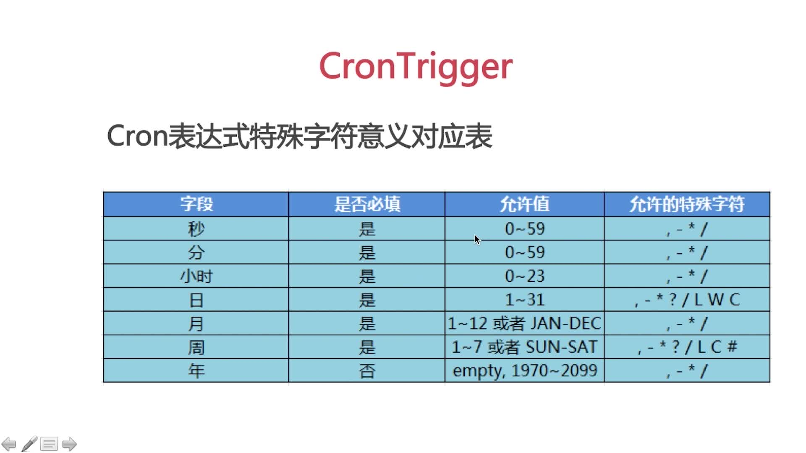
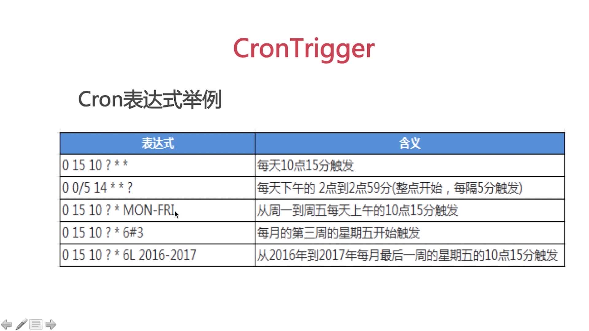
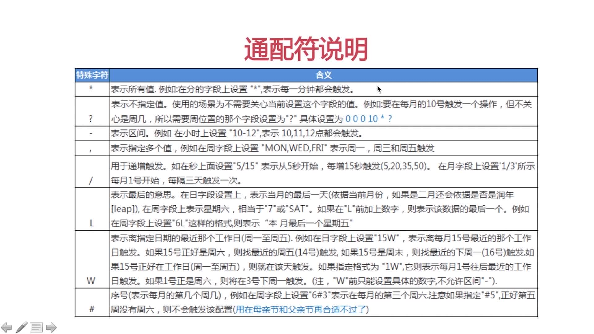

## cron表达式
程序示例[JobDemo](../src/main/java/xyz/gabear/schedule/JobDemo.java)
[SchedulerDemo](../src/main/java/xyz/gabear/schedule/SchedulerDemo.java)

    // [秒、分、时、日、月、周、年]
    // 1、2017年内每天10点15分触发一次     "0 15 10 ? * * 2017"
    // 2、每天的14点整至14点59分55秒，以及18点整至18点59分55秒，每5秒钟触发一次    "0/5 * 14,18 * * ?"
    // 3、每月周一至周五的10点15分触发一次     "* 15 10 ? * 2-6 *"
    // 4、每月最后一天的10点15分触发一次       "* 15 10 L * ? *"
    // 5、每月第三个周五的10点15分触发一次     "* 15 10 ? * 6#3 *"

