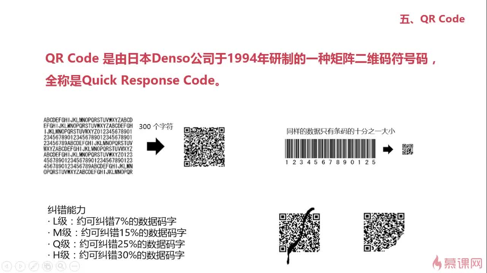

## QR Code介绍


## Java读写二维码
请见[示例](../src/main/java/xyz/gabear/exercise/QRCodeDemo.java)

## JavaScript读写二维码
开源项目[jquery.qrcode](https://github.com/jeromeetienne/jquery-qrcode)

示例
```html
<!DOCTYPE html>
<html>
<head>
    <title>二维码示例</title>
</head>
<body>
<script src="https://ajax.googleapis.com/ajax/libs/jquery/1.5.2/jquery.min.js"></script>
<script src="https://cdn.bootcss.com/jquery.qrcode/1.0/jquery.qrcode.min.js"></script>
<!-- <script type="text/javascript" src="../jquery.qrcode.min.js"></script> -->
<!-- <script type="text/javascript" src="../src/jquery.qrcode.js"></script> -->
<!-- <script type="text/javascript" src="../src/qrcode.js"></script> -->

<p>Render in table</p>
<div id="qrcodeTable"></div>
<p>Render in canvas</p>
<div id="qrcodeCanvas"></div>
<script>
    //jQuery('#qrcode').qrcode("this plugin is great");
    jQuery('#qrcodeTable').qrcode({
        render: "table",
        text: "http://jetienne.com"
    });
    jQuery('#qrcodeCanvas').qrcode({
        text: "http://jetienne.com"
    });
</script>

</body>
</html>
```
