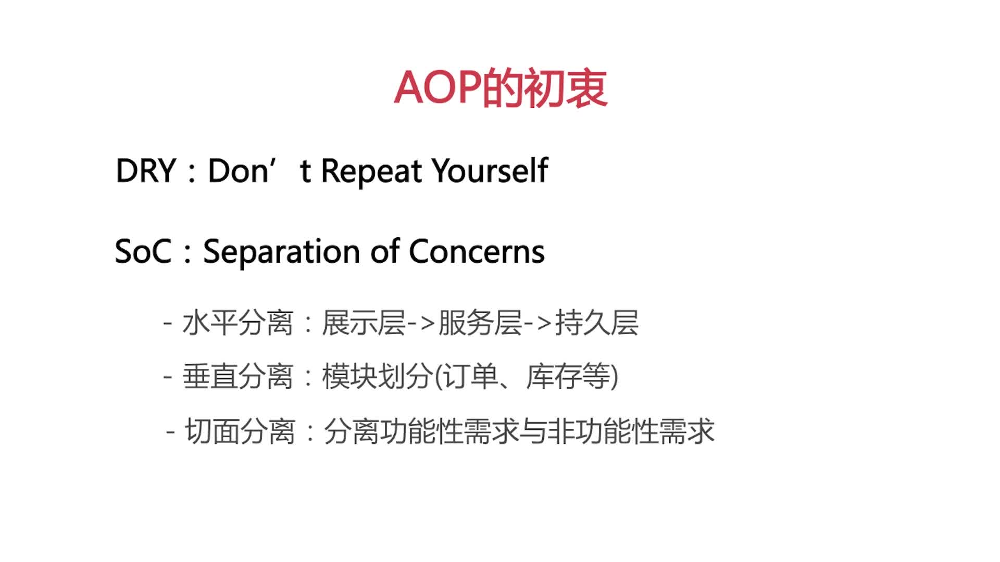
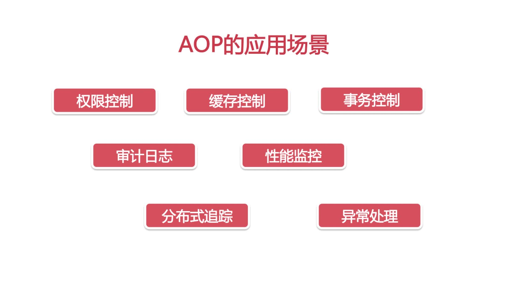
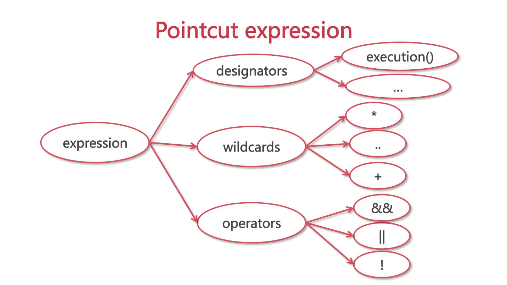
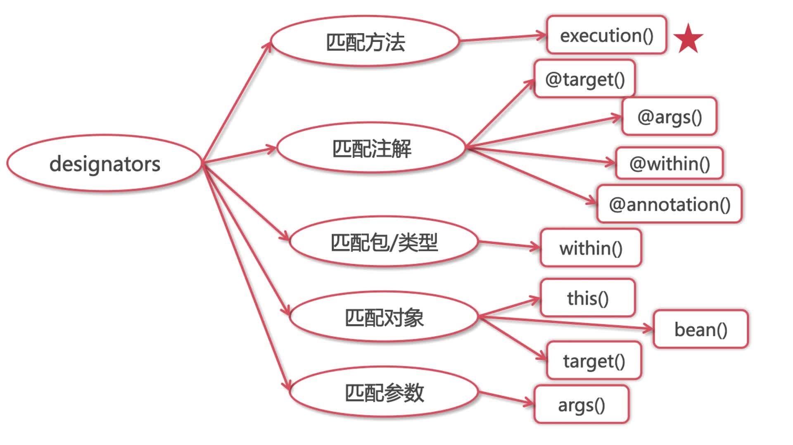

## 基础概念



## 使用注解实现AOP
1. 定义运行时注解，作用在类或者方法上
    ```java
        @Retention(RetentionPolicy.RUNTIME)
        @Target({ElementType.METHOD, ElementType.TYPE})
        public @interface AdminOnly {
        }
    ```
2. 定义切面
    ```java
        @Aspect
        @Component
        public class SecurityAspect {
            @Autowired
            private AuthService authService;
        
            @Pointcut("@annotation(AdminOnly)")
            public void adminOnly() {
        
            }
        
            @Before("adminOnly()")
            public void check() {
                authService.checkAccess(); // checkAccess()方法里具体写校验逻辑
            }
        }
    ```
3. 使用注解完成切面：直接在需要验证的类或者方法上加上`@AdminOnly`注解

## 切面表达式


- designators:指示器，描述通过什么方式去匹配Java的那些方法
    - execution()：匹配方法
    - within():匹配包/类型
    - this()/bean()/target():匹配对象
    - args():匹配参数  
- wildcards：通配符
    - `*` : 匹配任意数量的字符
    - `+` : 匹配指定类及其子类
    - `..` : 一般用于匹配任意数的子包或参数
- operators: 运算符(`&&`:与操作符; `||`或; `!`:非)



```text
    // within表达式
    @Pointcut("within(GirlService)") // 匹配GirlService类里面的所有方法
    @Pointcut("within(xyz.gabear.boot.service.*)") // 匹配Service包下所有类里面的所有方法
    @Pointcut("within(xyz.gabear.boot.service..*)") // 匹配service包及其所有子包下的所有类的所有方法

    // 对象匹配
    public class DemoDao implements BaseDao{}
    @Pointcut("this(xyz.gabear.DemoDao)") // 匹配AOP对象的目标对象为指定类型的方法，即DemoDao的AOP代理对象的方法---代理对象
    @Pointcut("target(xyz.gabear.BaseDao)") // 匹配实现BaseDao接口的目标对象(而不是AOP代理后的对象)的方法，这里即DemoDao的方法---原始对象
    @Pointcut("bean(*Service)") // 匹配所有以Service结尾的Bean里头的方法

    // 参数匹配
    @Pointcut("execution(**..find*(Long))") // 匹配任何以find开头而且只有一个Long参数的方法
    @Pointcut("execution(**..find*(Long,..))") // 匹配任何以find开头而且第一个参数为Long型的方法
    @Pointcut("args(Long)") // 匹配任何只有一个Long参数的方法
    @Pointcut("args(Long,..)") // 匹配第一个参数为Long型的方法
```


