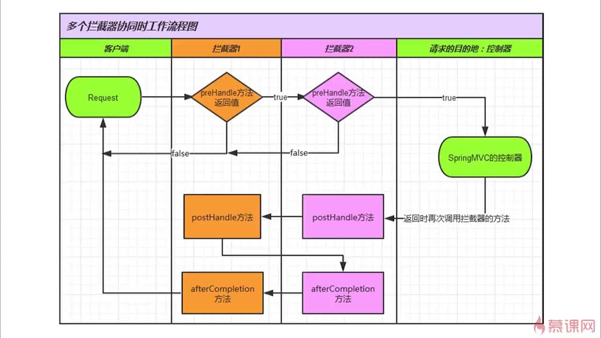

### 实现方式
1. 实现HandlerInterceptor(更常用) [程序示例](../src/main/java/xyz/gabear/learn/ssm/interceptor/ApiInterceptor.java)
2. 实现WebRequestInterceptor
> **注意区别:** 第二种方式的preHandler没有返回值，不能终止请求

### 配置多个拦截器，其执行顺序：
```text
preHandle-1
preHandle-2
controller
postHandle-2
postHandle-1
afterCompletion-2
afterCompletion-1
```

