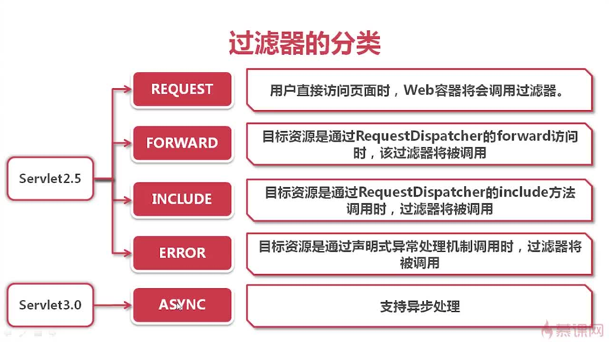
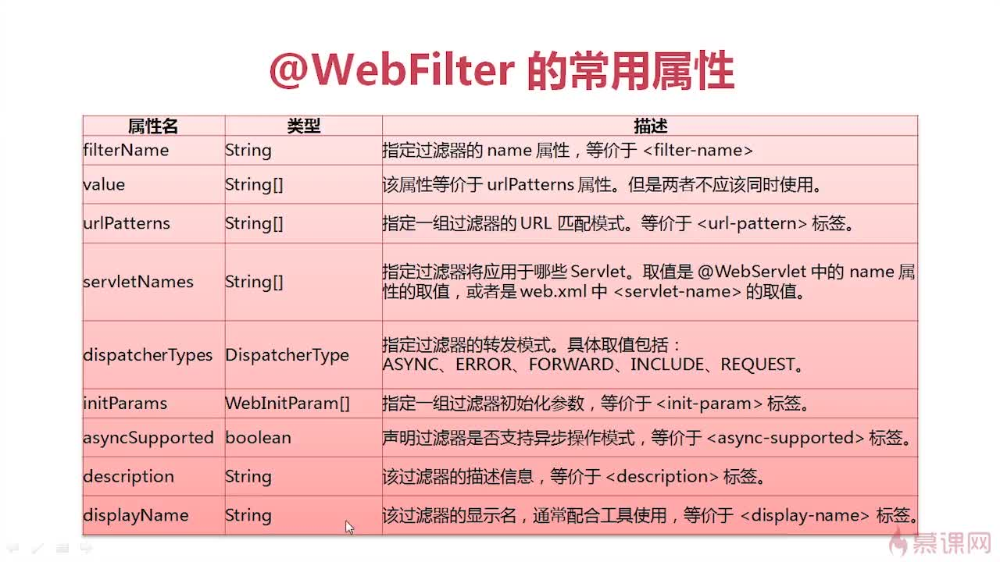

## 实现
- 实现`Filter`接口 [示例程序](../src/main/java/xyz/gabear/learn/ssm/filter/ApiAuthFilter.java)
- 多个过滤器过滤相同URL时，形成FilterChain。其doFilter执行顺序如下：
    ```text
    start---doFilter---firstFilter
    start---doFilter---secondFilter
    in JSP.
    end---doFilter---secondFilter
    end---doFilter---firstFilter
    ```
## 分类


**在Servlet3.0中使用`@WebFilter`注解**

